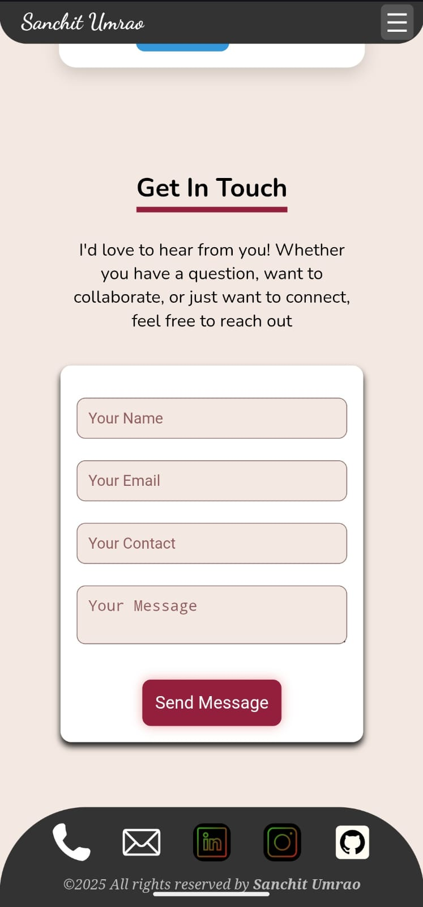

# 🌐 Sanchit Umrao — Portfolio Website

Welcome to the repository of my **personal portfolio website**!  
This website showcases my **skills, projects, and education** 
It’s built using modern web technologies with a focus on **performance, simplicity, and responsive design**.

---

## 🚀 Live Demo  
🔗 **Visit:** [https://sanchitumrao.github.io/portfolio-website/](https://sanchitumrao.github.io/portfolio-website/) 

---
## 📸 Screenshots
 
## 🛠️ Tech Stack

| Category | Technology |
|-----------|-------------|
| **Frontend** | HTML5, CSS3, JavaScript (Vanilla JS) |
| **Styling** | Flexbox, CSS Grid, Animations |
| **Deployment** | GitHub Pages |
| **Tools Used** | VS Code, Git, Github|

---
## 📁 Project Structure 
    
    ├── index.html   
    ├── main.css  
    ├── main.js   
    ├── Assets   
    └── README.md
   

## ✨ Features

- 🎨 **Modern UI/UX Design**
- 📱 **Fully Responsive Layout**
- ⚡ **Fast Loading Speed**
- 📬 **Functional Contact Form** (via EmailJS)
- 💼 **Project Showcase Section**
- 
## 🧑‍💻 How to Use Locally
1. **Clone the repository**
   ```
   git clone https://github.com/Sanchitumrao/portfolio-website.git
   
2. **Navigate to project folder**
   ```
   cd portfolio-website
 
## 📄 License
This project is open source and available under the [MIT License↗️](./LICENSE).

## 👨‍💻 Author
 Developed with ❤️ by *Sanchit Umrao*  
 🤝contributions are welcome. Fork the repo, make changes, and submit a pull request!
